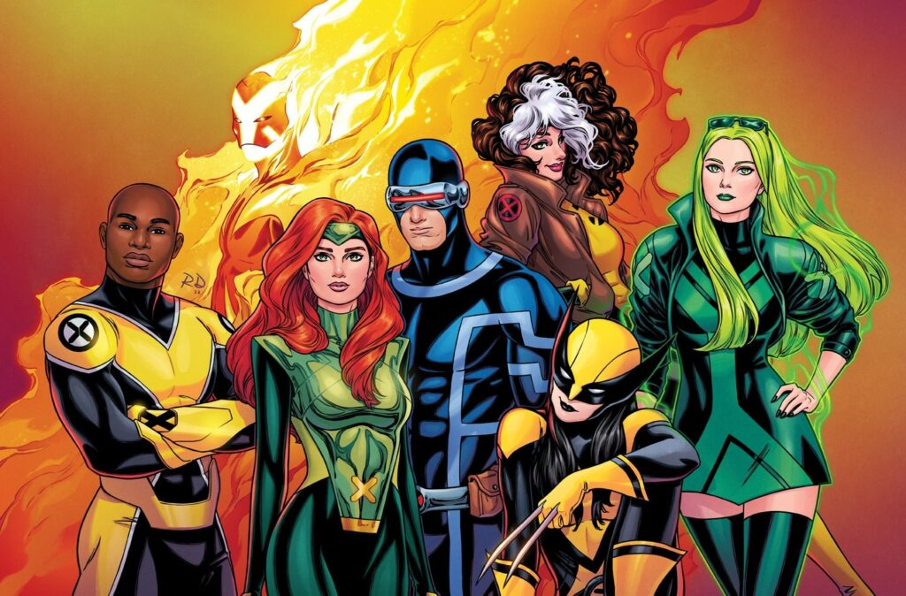

# X-Men

Atualmente os **X-Men** são uma equipe oficial que representa Krakoa, a nação mutante. E todos os anos, durante a cerimônia do Hellfire Gala, a população elege uma nova formação para seguir lhes representando. Inclusive, um integrante da equipe é sempre eleito via voto popular pelos leitores.

Membros atuais:
- Ciclope
- Wolverine
- Jean Grey
- Sincro
- Polaris
- Solaris
- Vampira

[Voltar](README.md)

